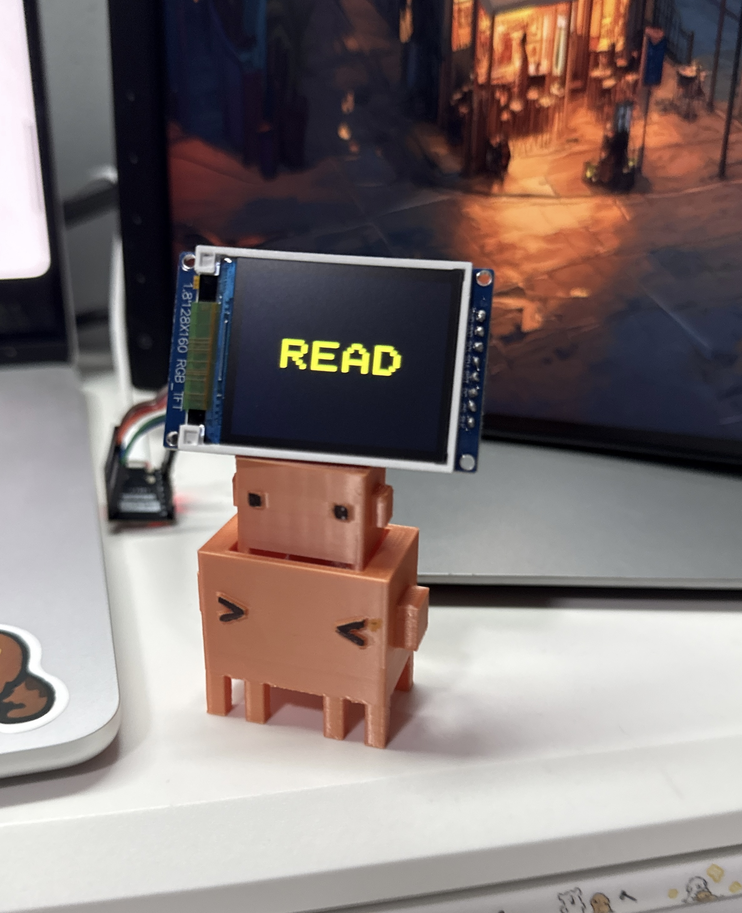
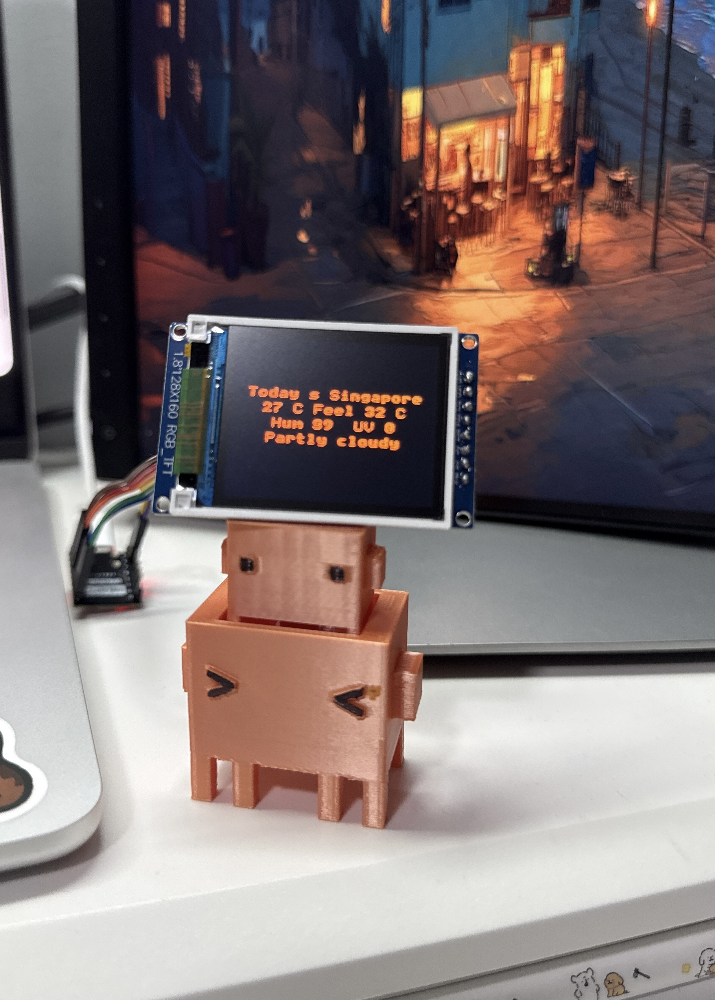

# AI External Screen for Claude Code

A tiny real-time status display for [Claude Code](https://claude.ai/code), built with an ESP32-C3 and a 1.8" TFT screen — held up by Clyde himself.



When Claude is working, the screen shows exactly what it's doing. When Claude is idle, it switches to a rest mode with a live clock, Singapore weather, and rotating quotes.

---

## What it shows

| Event | Display | Color |
|-------|---------|-------|
| You send a message | `COPY!` | Green |
| Claude thinking | `o → oo → ooo` | Orange (animated) |
| Claude reads a file | `READ` | Cyan |
| Claude edits a file | `EDIT` | Yellow |
| Claude runs a command | `BASH` | Red |
| Permission needed | `ASK!` | Magenta |
| Claude done | Robot face + `DONE` | Orange |

**Rest mode** (after 15s idle): clock → Singapore weather → motivational quote, rotating every 11 seconds.



---

## Hardware

| Part | Spec |
|------|------|
| Microcontroller | ESP32-C3 Super Mini |
| Display | 1.8" ST7735 TFT, 128×160, RGB |
| Wires | Dupont jumper wires (no soldering required for testing) |
| Connection | USB-C to Mac (no WiFi needed) |

---

## Wiring

| Screen Pin | ESP32-C3 GPIO | Wire Color |
|-----------|---------------|------------|
| VDD | 3.3V | Red |
| GND | GND | Brown |
| SCL (SCK) | GPIO 4 | Orange |
| SDA (MOSI) | GPIO 6 | Yellow |
| RES (RST) | GPIO 0 | Green |
| DC | GPIO 1 | Blue |
| CS | GPIO 7 | Purple |

> Note: Loose dupont wires cause white screen. Press firmly or solder for stable connection.

---

## Files

```
├── esp32/                  ← Upload these to ESP32
│   ├── claude_st7735.py    — ST7735 display driver
│   ├── claude_webserver_V1.py — Display logic & state handlers
│   └── main.py             — Serial loop with Timer animation
│
├── mac/                    ← Run these on Mac
│   ├── serial_hook.py      — Sends Claude events to ESP32 via USB serial
│   └── rest_mode.py        — Clock / weather / quotes when Claude is idle
```

---

## Setup

### ESP32

1. Flash MicroPython to ESP32-C3
2. Upload `claude_st7735.py`, `claude_webserver_V1.py`, `main.py` to the device root
3. Reboot — screen shows `HI`

### Mac

Install pyserial:
```bash
pip3 install pyserial
```

Add hooks to `~/.claude/settings.json`:
```json
{
  "hooks": {
    "Stop": [{"hooks": [{"type": "command", "command": "python3 /path/to/serial_hook.py", "async": true}]}],
    "UserPromptSubmit": [{"hooks": [{"type": "command", "command": "python3 /path/to/serial_hook.py", "async": true}]}],
    "PreToolUse": [{"matcher": "*", "hooks": [{"type": "command", "command": "python3 /path/to/serial_hook.py", "async": true}]}],
    "PermissionRequest": [{"matcher": "*", "hooks": [{"type": "command", "command": "python3 /path/to/serial_hook.py", "async": true}]}]
  }
}
```

Start rest mode in a separate terminal:
```bash
python3 rest_mode.py
```

---

## How it works

```
Claude Code fires a hook event
        ↓
serial_hook.py reads event from stdin
        ↓
Sends JSON line to ESP32 via USB serial
        ↓
ESP32 main.py receives and calls ClaudeAction._handle()
        ↓
Screen updates instantly
```

A `machine.Timer` on the ESP32 drives the thinking animation independently, so `o → oo → ooo` plays smoothly even while waiting for the next serial event.

---

Made with Claude Code, MicroPython, and a 3D-printed Clyde. 🤖
